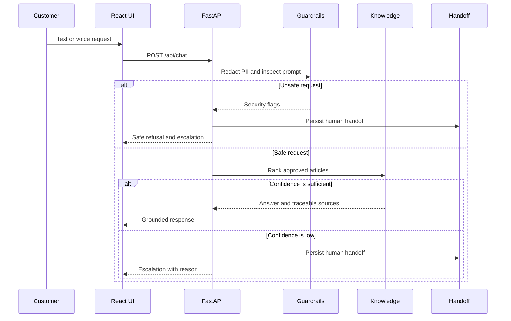

# Architecture

## Design goals

AutomatizoCX separates transport, business logic, persistence, integrations
and security so that each concern can be tested and replaced independently.

## Request lifecycle

## Backend boundaries

| Layer | Responsibility |
| --- | --- |
| Routers | HTTP contracts, access dependencies and response codes |
| Services | Use-case orchestration and business decisions |
| Repositories | SQLAlchemy reads and writes |
| Security | PII handling, injection detection, admin access and rate limiting |
| Integrations | External LLM and ticket-workflow communication |
| Schemas | Input validation and response serialization |
| Models | Persistent operational state |

## Persistent entities

| Entity | Important fields |
| --- | --- |
| KnowledgeArticle | bilingual content, intent, keywords, active state |
| ConversationTurn | redacted message, answer, confidence, latency, decision |
| HandoffTicket | reason, priority, transcript, queue and integration state |
| AuditEvent | action, entity, outcome and safe metadata |

## Reliability decisions

- The application operates without an external LLM.
- Handoff delivery sends an idempotency key and retries once.
- Failed delivery does not discard the locally persisted ticket.
- Health checks verify database connectivity.
- SQLite uses WAL mode and a busy timeout for safer concurrent portfolio use.
- Request IDs are returned to the caller and included in structured logs.
- Knowledge deletion is soft so operational history remains explainable.
